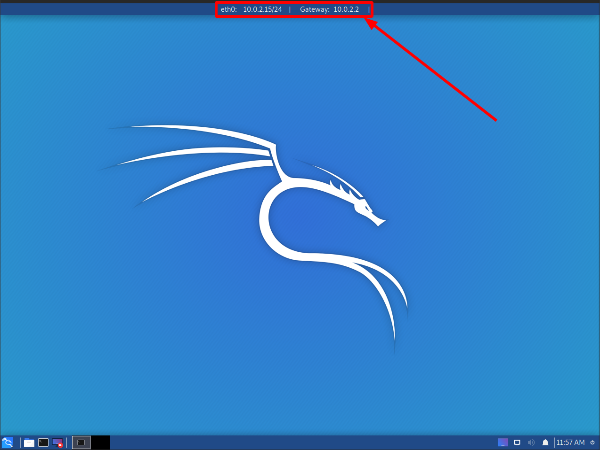
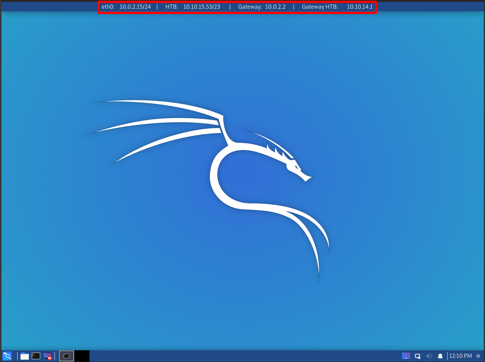
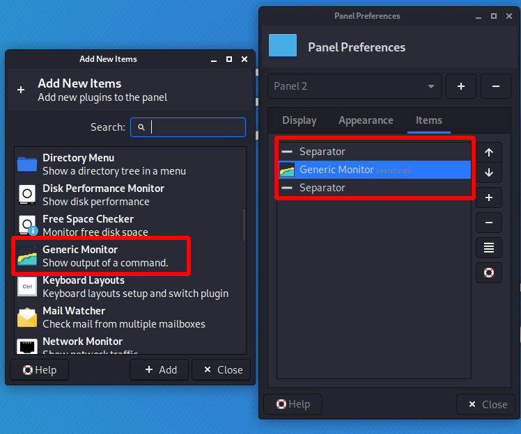
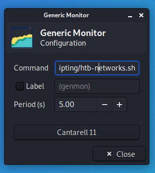

# How to use networks or htb-networks in Kali

- First we will need to have the xfce Generic Monitor widget

  

- Having this Widget enabled in some panel, we just need to put the htb-networks path.

  

- It can also be executed manually by terminal.